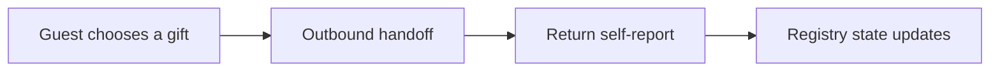
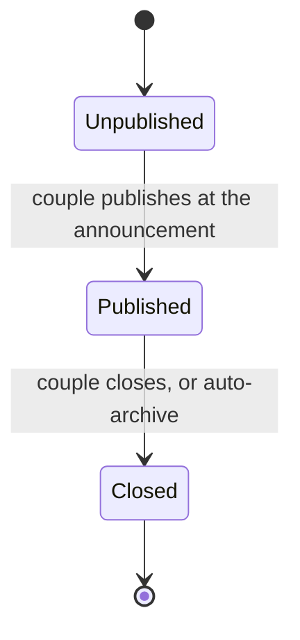

# PRD and UX spec

Scope: what we design now. Authority order is [decisions.md](decisions.md) first, this file second, [council briefs](council/) third. Where a council brief contradicts a locked decision, the locked decision wins and this file reflects it.

This document is the direct input to [figma-make/prompts.md](figma-make/prompts.md). No technology choices appear here.

## 1. What this is

A Hebrew, mobile-first baby registry ("רשימת לידה") that works across Israeli baby chains instead of being trapped inside one of them.

The couple builds one list during pregnancy, publishes it with the birth announcement, and shares one WhatsApp link. Guests open it without an account, see what is still needed, and give: a product from a chain, a contribution toward an expensive item, or cash via Bit/Paybox. Not a gift card. Nobody double-buys, and the couple knows who to thank.

**What we are not:** a shop. Because of D11 there is no checkout in our product and we never touch money. We are a coordination layer on top of transactions that happen somewhere else.

## 2. Why it can work here

Every Israeli incumbent is single-chain and login-gated. [Shilav](https://www.shilav.co.il/pages/baby-registry) has a registry behind a login, [Motsetsim](https://motsesim.co.il/) monetizes a checklist with no registry attached, [Agalis](https://www.agalease-baby.co.il/) and [Baby Star](https://www.baby-star.co.il/) sell birth packages. None of them can be cross-chain, because being cross-chain means recommending a competitor.

Cross-chain neutrality is the one thing no chain can offer its own customers, and it is precisely why the couple shares the link.

Honest read on the business, kept here so the design does not drift: the catalog earns the share. We do not sell gift cards. Nobody shares a link to a cash page; people share a link to "the things we need."

## 3. Actors and jobs

| Actor | Job | Success looks like |
|---|---|---|
| The couple | Stop answering "what do you need?" in thirteen separate chats, and end up with things they chose | A populated, shareable list in one sitting on a phone, then a tracker that tells them who to thank |
| The guest | Give something wanted, correct, and not duplicated, without joining anything | Lands from WhatsApp, understands the page in 3 seconds, gives in under 90 seconds, no account |
| The retailer | Incremental demand from a third party they have no relationship with | Out of scope this phase; the widget is a prototype only (D18) |

Design lifetime assumption: a registry is built around week 28, published at the announcement, peaks in the first month after birth, and dies. Nothing may assume a year of engagement.

## 4. The gifting model after D11

Every gift is the same three-beat pattern. This is the single most important structural idea in the product.

| Gift type | Handoff target | What the guest reports back |
|---|---|---|
| Product from a chain | The chain's own product page | "כן, רכשתי" (yes, I bought it) |
| Group gift on an expensive item | The couple's Bit or PayBox handle, revealed inline | That they sent it, plus an amount |
| Cash (`שי`, Bit/Paybox) | The couple's Bit or PayBox handle, revealed inline | That they sent it, plus an amount |

Consequences the design must honor:

- We never render a card field, a CVV, a payment sheet, or an order summary.
- Reservation is not purchase. State is honest about being self-reported, and the couple can correct anything (D16).
- Trust comes from the couple's names and photo, and from never asking for a card — not from a strip that says so.

## 5. Registry lifecycle (D14)

Two states are guest-facing, and they are two timestamps rather than a state machine (D30).

| State | Guest sees | Notes |
|---|---|---|
| Unpublished | Not found, identical to a wrong slug (D30) | Editor-only. The couple builds here during pregnancy; `published_at` is null |
| Published (`פורסמה`) | Full registry, items framed `נשלח אחרי הלידה` | Published with the birth announcement, which per D14 *is* the birth announcement |
| Closed (`נסגרה`) | Read-only thank-you summary, no giving | A stale open registry full of taken items is a trust event for a late guest |

There is no post-birth variant (D29). The list published at the announcement is the list, start to finish.

## 6. Surfaces and screens

Sample data for every mock: couple **נועה ואיתי** (Noa and Itai), baby girl **יעל**, due 12 בפברואר 2026. Chains: שילב, מוצצים, עגליס, בייבי סטאר.

### 6.1 Surface 1: public guest registry (the one screen that must be beautiful)

| ID | Screen | Job | Primary CTA |
|---|---|---|---|
| G1 | Hero / land | Couple photo, names, one-line story, progress, "how this works" in three lines | `לראות את הרשימה` (see the list) |
| G2 | Item grid + filters | Chips: `הכול` / `מה שעוד חסר` / `עד ₪100` / `₪100–₪300` / `מעל ₪300` / `מתנות משותפות` / `שי`. Categories: לינה, האכלה, ניידות, רחצה והחתלה, ביגוד, צעצועים | `לפרטים` (details) |
| G3 | Item detail sheet | Image, full name, price, chain chip, quantity line, couple note, price disclaimer | `אני קונה את זה` (I'm buying this) |
| G4 | Reserve and hand off | Confirms the hold, then sends the guest out to the chain. Leaving this sheet without continuing hands the unit back (D33). No name is asked here - that happens once, at G9 (D36). If the couple stored a shipping address, a link `צריכים את כתובת המשלוח של נועה ואיתי?` reveals it on tap with a copy button and the line that it does not transfer into the shop (D49) | `להמשיך לאתר שילב` (continue to Shilav) |
| G5 | Return self-report modal | The D12 moment. `האם רכשת את הפריט?` with `כן, רכשתי` and `לא רכשתי, לשחרר את הפריט`. Dismissing the question is the third answer and keeps the hold (D35) | `כן, רכשתי` (yes, I bought it) |
| G6 | Group gift sheet | Funding meter, `נותרו ₪550 מתוך ₪1,290`, `6 אורחים כבר השתתפו`, amount chips with a free-amount field behind `סכום אחר`, then the contact reveal | `להשתתף במתנה` (join this gift) |
| G7 | Cash envelope sheet | One plain cash envelope with no target and no meter (D28), titled from the live rails (`חיבוק בביט 💛` / `חיבוק בפייבוקס 💛` / `חיבוק בביט / פייבוקס 💛` / `חיבוק 💛`) (D37, D50). Guest word is `שי`, never `מעטפה`. Shows what has been given so far - `נאספו עד כה ₪2,150`, `11 אורחים כבר השתתפו` - on both the card and the sheet, and nothing at all before the first gift. Amount chips, then contact reveal. CTA names the live rails: `לשלוח בביט` / `לשלוח בפייבוקס` / `לשלוח בביט או בפייבוקס` / `לשלוח שי` | `לשלוח שי` (send cash) |
| G8 | Contact reveal | The D13 component. `צריכים את הפרטים של נועה ואיתי?` with one copy row per live rail (Bit then PayBox), each a phone number, the chosen amount restated, plus one `שלחתי` (I sent it), which is the write that records the gift (D38). No app chooser; the contribution does not record which app was used | `העתקה` (copy) |
| G9 | Private blessing + confirmation | Optional name and message straight to the couple, D17 private. The only place a guest is asked who they are (D36), and the write that attaches the name to the gift (D40). Then `תודה, רשמנו את המתנה שלך`, worded for a purchase or for money depending on which happened | `לצרף ברכה` (attach a blessing) |
| G10 | Error and edge shell | Not found, closed, offline | `לנסות שוב` (try again) |

Emotional register: guest surfaces read like a message from friends. First person plural, no marketing superlatives, no urgency, no scarcity timers, no discount language. Photography over illustration. The only tonal shift is at G8, where the UI turns plain and explicit because the person is about to send money somewhere.

### 6.2 Surface 2: couple editor

| ID | Screen | Job | Primary CTA |
|---|---|---|---|
| C0 | Get in | One email field, no password. A mailed one-time link, and a note that it is valid for twenty minutes. Says nothing about whether the address is known (D43) | `לשלוח לי קישור` |
| C1 | Create wizard, 2 steps | `איך לקרוא לכם` → `התאריך המשוער ללידה` + optional shipping address (street, entrance, floor, apartment, city, postal, notes; city is also the public caption). Address is skippable; the street is private (D49). שי is on by default; categories are filters on the list, not a create-time seed | `ליצור את הרשימה` |
| C2 | Editor home | The list, the progress line, and while `published_at` is null an unpublished banner with `לפרסם את הרשימה`. This banner is the only place unpublished is ever surfaced (D30). Once published it shows the link and a copy button; the full share surface is C8. Story, payment and address are not on this list — they sit behind a header settings icon. Untouched products have a trailing × that hides the row with undo; taken items and unused שי do not. Category chips (`הכול` plus groups that currently have items) cut a long list. Drag to reorder is not built yet | `להוסיף פריט` |
| C3 | Add item | Tabs: `מהחנויות` (search the harvested catalog), `משהו אחר` (title, price, category, a link as plain text). Catalog rows have a quiet `לראות באתר {chain}` next to `להוסיף`. `להדביק קישור` with a parsed preview needs the resolver and lands with it | `להוסיף לרשימה` |
| C4 | Item settings | Quantity with a floor at what guests already hold, couple note, `לאפשר מתנה משותפת` with a hint above ₪400. Controls the couple may not undo are disabled with the reason beside them (D45). Remove is an in-app confirm; items with history deactivate rather than delete. A product with a shop URL has `לראות באתר {chain}` | `לשמור` |
| C5 | Bit and PayBox numbers | One phone and a display name (prefilled from what they already saved, or the list names), both editable. The שי checkbox is what puts the cash tile on the list; an empty field is not an off switch. Save writes the same number to Bit and PayBox (D50). No tabs, no chain gift cards. Shipping address is on its own screen (D49). No target to set (D28) | `לשמור` |
| C6 | Story and cover | Photo, two-line story | `לשמור` |
| C7 | Preview as guest | Real guest render in a device frame, banner `זו התצוגה שהאורחים רואים` | `חזרה לעריכה` |
| C8 | Publish and share | The D14 announcement moment. WhatsApp-first, designed link-preview card, editable Hebrew message, QR for the ברית | `לשתף בוואטסאפ` |
| C9 | Gift tracker | Table: פריט / מי / מתי / סטטוס / תודה. Chips `נתפס`, `נרכש`, `התקבל`. Per-guest amounts appear here and nowhere else (D15). Release and correct controls (D16) | `לומר תודה` |
| C10 | Settings and lifecycle | Header gear on editor home. Story, Bit/PayBox, shipping address, sign out. `לסגור את הרשימה`, visibility and delete land here later | — |

### 6.3 Surface 3: retailer widget (prototype only, D18)

No partnership is assumed, so there is no attribution panel, no revenue narrative, and no retailer co-branding. The mock product page is visibly generic, never a clone of a real chain's storefront.

| ID | Screen | Notes |
|---|---|---|
| R1 | Button on a generic mock product page | Secondary weight, under the shop's own add-to-cart: `הוספה לרשימת לידה`. Never outshouts the retailer's CTA |
| R2 | Sheet, has a registry | Product thumbnail, `לאיזו רשימה להוסיף?`, quantity, then `נוסף לרשימה שלכם` |
| R3 | Sheet, no registry | `עוד אין לכם רשימת לידה?` plus one-field lite create. The item is carried in, never lost. Ends on `פתחנו לכם רשימה — הפריט הראשון כבר בפנים` |

## 7. State inventory

Figma Make defaults to the happy path and to full lists, so every state below needs its own frame.

| State | Where | Treatment | Hebrew string |
|---|---|---|---|
| Empty registry | G2 | No grid. Warm card, no illustration | `נועה ואיתי עוד מכינים את הרשימה` |
| Single item | G2 | One full-width hero card, never a lonely grid cell | `בינתיים יש פריט אחד ברשימה` |
| Fully claimed | G2 | Celebratory band, the cash gift promoted | `כל הפריטים ברשימה נתפסו. אפשר עוד לתת שי` |
| Reserved by someone else | G2, G3 | Muted card, badge, CTA demoted | `כבר נתפס` / `לתת שי במקום` |
| Held by you | G2, G5 | Live card, primary badge. Dismissing the report keeps the hold (D35); tapping the card reopens G5. Other guests still see `כבר נתפס` | `שמור לך` |
| Group gift partly funded | G3, G6 | RTL meter, remaining amount is the headline, never the percent | `נותרו ₪550 מתוך ₪1,290` |
| Group gift complete | G6 | Full meter, closed CTA | `המתנה הושלמה. תודה לכל מי שהשתתף` |
| Envelope with gifts in it | G2, G7 | Collected total and contributor count, no meter and no `מתוך` (D28) | `נאספו עד כה ₪2,150` |
| Quantity partly fulfilled | G2, G3 | Counter chip, CTA stays live | `נשארו 2 מתוך 4` |
| Handoff pending | G2, G5 | Guest went out and came back without answering. Dismissing the question keeps the hold; an explicit `לא רכשתי` releases it (D35). The holder's card reads `שמור לך`, not `כבר נתפס` | `עוד באמצע? אפשר לסגור — הפריט נשאר שמור לכם` |
| Price may differ | G3 | Permanent, quiet, never a warning color. Carries the whole "reality lives at the chain" message now that stock is gone (D26) | `המחיר מתעדכן באתר החנות` |
| Broken image | G2, G3 | Branded 1:1 placeholder with category glyph and product name. Never a gray box with alt text, never a layout shift | none |
| Long Hebrew name | G2, G3 | Two-line clamp with reserved min-height, badges wrap and never truncate | `עגלת תאומים משולבת עם סלקל…` |
| Closed registry | G10 | Read-only thank-you summary | `הרשימה נסגרה. תודה לכל מי שהשתתף` |
| Not found | G10 | Assume a truncated WhatsApp link | `הרשימה לא נמצאה. אולי הקישור לא הועתק במלואו` |
| Offline while browsing | G2 | Inline retry row, keeps cached items | `משהו נתקע. לנסות שוב?` |
| Reserve race | G3, G4 | Optimistic UI must be reversible: the hold is taken on tap, so the guest lands on the taken sheet with this line instead of the handoff sheet. Reworded from `בזמן שמילאת` because the hold now precedes the form (D33) | `בזמן שהתלבטת, אורח אחר לקח את הפריט` |

## 8. RTL rules

Non-negotiable, and the thing Figma Make will get wrong by default.

- `dir="rtl"` at root, logical properties only. Sheets and drawers enter from the right. Toast text right-aligned, close affordance on the left.
- Back chevrons point right; forward and "more" point left. Mirror arrows, back, share, next and previous. Do not mirror checkmarks, hearts, gift boxes, clocks, or store logos.
- Progress bars, funding meters and step indicators fill right to left, flush to the right edge. Wizard step 1 sits at the far right.
- Card interiors: thumbnail on the right edge, text right-aligned beside it, price and CTA on the left edge. Carousels start at the rightmost card.
- Numbers, prices, dates and Latin brand names are LTR runs inside RTL text and must be treated as single unbreakable tokens: `₪149`, `₪1,290`, `₪100–₪300`, `12.2.2026`, `Maxi-Cosi`. The shekel sign precedes the digits. A price never splits across a line break.
- Prefer `12 בפברואר 2026` in body copy; dotted dates only in dense tables.
- Ellipsis renders at the visual left end. Hebrew does not hyphenate, so use a two-line clamp with reserved height rather than a single-line ellipsis in grids. Never truncate a price, a status badge, or a remaining amount.
- Typography: Heebo, line height about 1.5, no italics, no all-caps and no letter-spacing for emphasis since Hebrew has no case. Use weight and size. Body minimum 16px.
- Forms: labels and helper text right-aligned; amount and phone inputs stay LTR internally with a right-aligned label; validation icon on the right of the field.

## 9. Design tokens

Concrete values, because abstract style words produce abstract output.

| Token | Value | Use |
|---|---|---|
| Background | `#FBF6F4` | Page. Warm cream, not paper-white |
| Surface | `#FFFCFB` | Cards, sheets |
| Ink | `#2A2528` | Headings, body, and type on filled pastels |
| Ink muted | `#6A6366` | Secondary text, helper copy |
| Primary | `#FFB6C1` | The verb: every primary CTA. A light tint, so the type on it is ink, never white |
| Primary hover / active | `#DFA0AA` / `#D0969F` | Derived by mixing the fill toward ink |
| On-primary | `#2A2528` | Button and chip copy on the pink fill (WCAG AA) |
| Primary ink | `#7A3F54` | Primary *text* on cream (links, row affordances). The fill is too light to use as type |
| Accent | `#A2CFFE` | The map: selected filters and chips, how-it-works numbers, wizard progress, funding meters, the envelope tile |
| On-accent | `#2A2528` | Type on the sky fill, same charcoal as on-primary |
| Accent ink | `#2E4A66` | Type on the blue tint |
| Success | `#3E7D55` | Confirmed and received states. White type (already AA) |
| Danger | `#A8443B` | Editor only: a refused save, the remove action. The guest surface states problems in words |
| Muted / taken | `#8A8588` | Disabled chrome. Claimed pills use a tint + muted ink, not white on grey |
| Border | `#E8DDE0` | Hairlines, card strokes |

Radius 16px cards, 12px buttons, 999px pills. Spacing on an 8pt grid. Type scale: H1 28, H2 22, H3 18, body 16, small 14. Weights 400, 500, 700. Mobile canvas 390px; desktop is the same content centered at max 1120px with a three-column grid and a sticky summary rail on the right.

## 10. Non-goals

- Any checkout, card field, payment sheet, escrow, refund flow, or fund custody (D11).
- Automatic purchase detection, retailer webhooks, price-drop alerts.
- Stock and availability in any form: no sync, no cached flag, no out-of-stock state (D26).
- Item priority or importance ranking, and sorting by it (D27).
- Named or targeted cash funds, and a post-birth mode (D28, D29).
- Guest accounts, guest login, guest history, guest-to-guest visibility.
- Public blessings wall or guestbook (D17).
- Real retailer integrations, contracts, feeds, attribution panels, merchant dashboards (D18).
- Own storefront, warehouse, shipping, gift receipts, returns, completion discounts. Showing the couple's address to a guest who is leaving for the shop is D49, not us shipping.
- Browser extension, baby-shower invitations, editorial content, pregnancy tracking, breast-pump flows.
- Occasions other than baby; any English UI; native apps; dark mode.
- Public discoverability and SEO. Lists are unlisted with a long random slug and noindex.

## 11. Risks carried into design

1. **The link reads as phishing.** An unfamiliar Hebrew domain in a group message, mentioning money, to an audience trained on delivery-SMS fraud. D11 helps enormously here: we can truthfully say we never ask for payment details. Say it on the page.
2. **Self-reported state is unenforceable.** A guest who reserves and never confirms freezes the best item. D16's couple-side release control is the mitigation, and it must be visible in the tracker design.
3. **Cash cannibalizes products.** If the money tile is the easiest one, retailers never see attributed orders. Tile hierarchy must make the product tile the more attractive object.
4. **Mocks flatter the demo and lie later.** The price disclaimer is a designed, permanent element, not a later pass.
5. **RTL failure is invisible.** Mirrored-but-wrong screens look fine and get approved. Section 8 exists to be checked literally, one line at a time, against the Make output.
